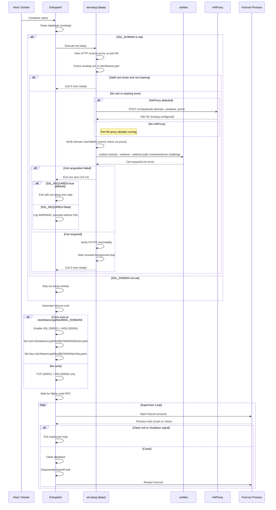

# Fulcrum-Alpha SSL Integration Specification

**Status:** Draft
**Date:** 2026-03-30
**Scope:** Migration from host-managed SSL injection to in-container SSL management via the `ssl-manager` base image

---

## 1. Overview

### What Changes

Fulcrum-Alpha currently obtains SSL certificates through a fragile host-side injection mechanism: `run-fulcrum.sh` starts the container, copies certificate files into it via `docker cp`, then touches a signal file (`/tmp/.fulcrum-ready`) to tell the entrypoint that the files have arrived. This creates a race condition window, requires the host to have direct access to certificate files, and cannot renew certificates without manual intervention.

The new design replaces this with a self-contained SSL lifecycle managed inside the container. The Fulcrum runtime image is built on top of an `ssl-manager` base image that provides certbot, HAProxy registration, and reachability verification. The container acquires and renews its own certificates without host involvement.

### Why

1. **Eliminates the signal-file race condition.** The current entrypoint waits up to 60 seconds for `/tmp/.fulcrum-ready`, and if the host script is slow or the container restarts, the entrypoint either starts without SSL or picks up stale certificates.
2. **Enables automatic certificate renewal.** Let's Encrypt certificates expire every 90 days. The current setup has no renewal mechanism.
3. **Supports HAProxy-routed deployments.** When multiple services share ports 80/443 on a single host, HAProxy routes traffic by SNI/Host header. The container must register itself with HAProxy and coordinate HTTP-01 challenges through it.
4. **Simplifies the host-side launcher.** `run-fulcrum.sh` no longer needs to locate certificates, dereference Let's Encrypt symlinks, or perform `docker cp` operations.

### What Does Not Change

- The Fulcrum C++ binary, its configuration format, and its protocol behavior are unchanged.
- The builder stage of the Dockerfile (compiling Fulcrum from source) is unchanged.
- The supervisor loop with crash recovery and exponential backoff is unchanged.
- The Alpha node RPC connection logic is unchanged.
- Fulcrum's Electrum protocol ports (50001-50004) remain the same.

---

## 2. Dockerfile Changes

### Current Structure

```
Stage 1: FROM debian:trixie AS builder    (compile Fulcrum)
Stage 2: FROM debian:trixie-slim          (runtime)
```

### New Structure

```
Stage 1: FROM debian:trixie AS builder    (compile Fulcrum -- unchanged)
Stage 2: FROM ssl-manager:latest          (runtime -- new base)
```

### Stage 1: Builder (Unchanged)

```dockerfile
FROM debian:trixie AS builder

LABEL maintainer="Fulcrum-Alpha Development"

ARG MAKEFLAGS

RUN apt update -y && \
    apt install -y \
        openssl git build-essential pkg-config zlib1g-dev libbz2-dev \
        libjemalloc-dev libzmq3-dev qtbase5-dev qt5-qmake libminiupnpc-dev

WORKDIR /src
COPY . .

RUN qmake -makefile PREFIX=/usr Fulcrum.pro && \
    make $MAKEFLAGS install
```

### Stage 2: Runtime (New)

```dockerfile
FROM ssl-manager:latest

# ssl-manager is based on debian:trixie-slim and already includes:
#   certbot, openssl, curl, jq, netcat-openbsd, procps, cron
#
# Fulcrum-specific runtime dependencies only:
RUN apt-get update && \
    apt-get install -y --no-install-recommends \
        libqt5network5 \
        zlib1g \
        libbz2-1.0 \
        libjemalloc2 \
        libzmq5 \
        python3 \
        libminiupnpc18 && \
    apt-get clean && \
    rm -rf /var/lib/apt/lists/* /tmp/* /var/tmp/*

COPY --from=builder /src/Fulcrum /usr/bin/Fulcrum
COPY --from=builder /src/FulcrumAdmin /usr/bin/FulcrumAdmin

RUN mkdir -p /etc/fulcrum /data

COPY docker/fulcrum.conf.default /etc/fulcrum/fulcrum.conf.default

VOLUME ["/data"]
ENV DATA_DIR=/data

# Fulcrum Electrum protocol ports
EXPOSE 50001 50002 50003 50004

# Port 80 is used by ssl-manager's HTTP reverse proxy (EXPOSE'd by base image)

HEALTHCHECK --interval=30s --timeout=10s --start-period=120s --retries=3 \
    CMD nc -z localhost 50001 || exit 1

COPY docker/docker-entrypoint.sh /entrypoint.sh
RUN chmod +x /entrypoint.sh

ENTRYPOINT ["/entrypoint.sh"]
CMD ["Fulcrum"]
```

### Key Differences from Current Dockerfile

| Aspect | Current | New |
|--------|---------|-----|
| Runtime base image | `debian:trixie-slim` | `ssl-manager:latest` |
| Packages removed | `openssl`, `netcat-openbsd`, `procps` | Provided by `ssl-manager` base |
| Packages added | None | None (ssl-manager provides certbot, curl, jq) |
| `SSL_CERTFILE` / `SSL_KEYFILE` env vars | Present | Removed |
| Health check `start-period` | 60s | 120s (allows time for SSL setup) |
| Port 80 | Not exposed | Exposed by base image |

### Package Overlap Analysis

The `ssl-manager` base image (derived from `debian:trixie-slim`) already includes:

- `openssl` -- was in Fulcrum's runtime deps, no longer needed in the Fulcrum layer
- `procps` -- was in Fulcrum's runtime deps, no longer needed
- `netcat-openbsd` -- was in Fulcrum's runtime deps, no longer needed
- `curl`, `jq` -- not previously in Fulcrum, available from base for health checks
- `cron` -- not previously in Fulcrum, available from base (cert renewal uses a background loop instead)

Fulcrum-specific packages that remain in the Fulcrum layer:

- `libqt5network5` -- Qt Network module (Fulcrum's async I/O and SSL/TLS)
- `zlib1g` -- compression library
- `libbz2-1.0` -- bzip2 compression (RocksDB dependency)
- `libjemalloc2` -- memory allocator
- `libzmq5` -- ZeroMQ (bitcoind notifications)
- `python3` -- FulcrumAdmin script
- `libminiupnpc18` -- UPnP support

---

## 3. Entrypoint Flow

### Step-by-Step Sequence

```
1. Clean database (existing behavior)
2. Call ssl-setup (from base image)
   2a. ssl-setup starts the HTTP reverse proxy on port 80. The proxy intercepts
       /.well-known/acme-challenge/ for certbot and /_ssl/* for management
       endpoints, forwarding all other traffic to localhost:$APP_HTTP_PORT.
       For Fulcrum, no application HTTP server runs, so non-ssl paths return
       502 (expected behavior).
   2b. If SSL_DOMAIN is set:
       - Detect HAProxy (HAPROXY_HOST env or Docker DNS)
       - If HAProxy found: register with HAProxy Registration API
       - Run certbot for HTTP-01 challenge
       - Verify reachability (HTTP and HTTPS)
       - Certs land in /etc/letsencrypt/live/$SSL_DOMAIN/
   2c. If SSL_DOMAIN is not set:
       - ssl-setup exits 0 with no action
3. Generate fulcrum.conf
   3a. Start from fulcrum.conf.default or env-var-driven template
   3b. Set bitcoind, rpcuser, rpcpassword from env vars
   3c. Always enable: tcp=0.0.0.0:50001, ws=0.0.0.0:50003
   3d. If SSL certs exist at /etc/letsencrypt/live/$SSL_DOMAIN/:
       - Enable ssl=0.0.0.0:50002
       - Enable wss=0.0.0.0:50004
       - Set cert/key paths to letsencrypt paths
   3e. If no SSL certs: leave ssl/wss commented out
4. Wait for Alpha node RPC (existing behavior)
5. Start Fulcrum supervisor loop (existing behavior)
```

### Decision Points and Error Handling

**ssl-setup failure (exit code non-zero):**
- Default behavior (`SSL_REQUIRED=true`, which is implicit when `SSL_DOMAIN` is set): ssl-setup failure causes the entrypoint to exit with ssl-setup's exit code (10-14). This is fail-fast -- if SSL was requested and cannot be obtained, the container does not start in a degraded state.
- When `SSL_REQUIRED=false` is explicitly set: ssl-setup failure causes the entrypoint to log a WARNING and fall back to TCP-only mode. The warning message must clearly state: domain was requested, cert was not obtained, running without SSL. Exit code from ssl-setup is logged but does not terminate the container.
- This ensures operators must explicitly opt in to degraded mode rather than silently losing SSL.

**Certbot rate limits:**
- Let's Encrypt enforces 5 duplicate certificates per week and 50 certificates per registered domain per week. If the container restarts frequently, certbot may hit rate limits.
- Mitigation: ssl-setup checks for an existing valid certificate in `/etc/letsencrypt/live/$SSL_DOMAIN/` before requesting a new one. The `/etc/letsencrypt` volume persists across container restarts.

**HAProxy unreachable:**
- If `HAPROXY_HOST` is set but the HAProxy Registration API is unreachable, ssl-setup logs a warning and attempts webroot HTTP-01 challenge (certbot uses webroot mode via the HTTP reverse proxy on port 80, which also serves HAProxy health checks and forwards non-ssl traffic to `localhost:$APP_HTTP_PORT`).
- If webroot challenge also fails, falls back to TCP-only.

### Certificate Expiry Logging

On every Fulcrum startup (after SSL setup), log the certificate expiry date:

    EXPIRY=$(openssl x509 -enddate -noout -in /etc/letsencrypt/live/$SSL_DOMAIN/fullchain.pem)
    echo "SSL certificate for $SSL_DOMAIN expires: $EXPIRY"

The renewal loop should also log this after each renewal check. This ensures
cert expiry is visible in `docker logs` without requiring manual inspection.

### SSL_TEST_MODE Production Warning

If SSL_TEST_MODE is set, log a prominent warning:

    echo "WARNING: SSL_TEST_MODE is active -- using self-signed certificate"
    echo "WARNING: This is NOT suitable for production. Clients will reject this certificate."

### Startup Ordering with HAProxy

Docker provides no startup ordering guarantee. When ssl-setup cannot reach the
HAProxy Registration API, it should retry with exponential backoff INSIDE
ssl-setup (separate from Docker's restart count):

- Initial wait: 2 seconds
- Backoff: 2s, 4s, 8s, 16s, 32s, 60s, 60s, ... (capped at 60s)
- Maximum total wait: 5 minutes
- If HAProxy is still unreachable after 5 minutes, exit with code 13

This internal retry prevents Docker's `on-failure:5` restart limit from being
exhausted during normal host boot ordering. Five ssl-setup retries x 5 minutes
each = 25 minutes of tolerance for HAProxy startup delays.

### Shutdown Cleanup (Deregistration Trap)

On container shutdown (SIGTERM), the entrypoint should:
1. Deregister from HAProxy: DELETE /v1/backends/$SSL_DOMAIN
2. Stop the HTTP reverse proxy on port 80
3. Stop the renewal loop
4. Forward SIGTERM to Fulcrum (existing behavior)

This prevents stale HAProxy entries that would cause 409 Conflict when
the same domain is registered from a different container.

### Mermaid Sequence Diagram



---

## 4. Configuration Generation

### How fulcrum.conf Is Built

The entrypoint generates `/data/fulcrum.conf` from environment variables and SSL state. This replaces the current approach where `run-fulcrum.sh` generates the config on the host and copies it into the container.

### Config Generation Function

```bash
generate_fulcrum_config() {
    local config_file="/data/fulcrum.conf"
    local ssl_available=0

    # Check if SSL certs are available
    if [ -n "$SSL_DOMAIN" ] && \
       [ -f "/etc/letsencrypt/live/$SSL_DOMAIN/fullchain.pem" ] && \
       [ -f "/etc/letsencrypt/live/$SSL_DOMAIN/privkey.pem" ]; then
        ssl_available=1
    fi

    cat > "$config_file" << CONF
# Auto-generated Fulcrum configuration
# Generated at: $(date -u +"%Y-%m-%dT%H:%M:%SZ")

# Alpha Node Connection
bitcoind = ${RPC_HOST:-alpha-node}:${RPC_PORT:-8589}
rpcuser = ${RPC_USER:-user}
rpcpassword = ${RPC_PASS:-password}

# Coin Type
coin = alpha

# Data Directory
datadir = /data

# Network Interfaces -- always enabled
tcp = 0.0.0.0:50001
ws = 0.0.0.0:50003
CONF

    if [ $ssl_available -eq 1 ]; then
        cat >> "$config_file" << CONF

# SSL/TLS -- auto-configured from Let's Encrypt
ssl = 0.0.0.0:50002
cert = /etc/letsencrypt/live/${SSL_DOMAIN}/fullchain.pem
key = /etc/letsencrypt/live/${SSL_DOMAIN}/privkey.pem
wss = 0.0.0.0:50004
wss_cert = /etc/letsencrypt/live/${SSL_DOMAIN}/fullchain.pem
wss_key = /etc/letsencrypt/live/${SSL_DOMAIN}/privkey.pem
CONF
    else
        cat >> "$config_file" << CONF

# SSL/TLS -- not configured (no SSL_DOMAIN or cert acquisition failed)
#ssl = 0.0.0.0:50002
#wss = 0.0.0.0:50004
CONF
    fi

    cat >> "$config_file" << CONF

# Performance Settings
db_max_open_files = ${DB_MAX_OPEN_FILES:-200}
db_mem = ${DB_MEM:-1024.0}
utxo_cache = ${UTXO_CACHE:-2048.0}
worker_threads = ${WORKER_THREADS:-0}

# Server Identification
hostname = ${FULCRUM_HOSTNAME:-fulcrum-alpha.local}
banner = "${FULCRUM_BANNER:-Welcome to Fulcrum-Alpha (Alpha SPV Server)}"

# Request Limits
max_clients = ${MAX_CLIENTS:-1000}
max_history = ${MAX_HISTORY:-125000}
max_buffer = ${MAX_BUFFER:-10000000}
max_batch = ${MAX_BATCH:-500}

# Administration
peering = false
admin = ${ADMIN_PORT:-8000}
stats = ${STATS_PORT:-8080}

# Logging
debug = ${DEBUG:-false}
CONF

    # Restricts read access because the file contains RPC credentials in plaintext.
    chmod 600 "$config_file"
}
```

### Certificate Path Convention

Fulcrum reads certificate files directly from the Let's Encrypt live directory. This is a change from the current approach where certificates are copied to `/data/fulcrum.crt` and `/data/fulcrum.key`.

| Current | New |
|---------|-----|
| `/data/fulcrum.crt` | `/etc/letsencrypt/live/$SSL_DOMAIN/fullchain.pem` |
| `/data/fulcrum.key` | `/etc/letsencrypt/live/$SSL_DOMAIN/privkey.pem` |
| `/ssl/fullchain.pem` (intermediate) | Eliminated |
| `/ssl/privkey.pem` (intermediate) | Eliminated |

Reading directly from `/etc/letsencrypt/live/` means that when certbot renews certificates (updating the symlinks), the next Fulcrum restart automatically picks up the new certificates without any copy step.

---

## 5. Network Topology

### Current: Single Network

```
Host
 |
 +-- alpha-net (Docker bridge)
      |
      +-- alpha-node (Alpha full node, RPC on 8589)
      +-- fulcrum-alpha (Fulcrum, ports 50001-50004)
```

### New: Dual Network (HAProxy Mode)

```
Host
 |
 +-- alpha-net (Docker bridge) ........... private, RPC traffic only
 |    |
 |    +-- alpha-node (port 8589)
 |    +-- fulcrum-alpha
 |
 +-- haproxy-net (Docker bridge) ......... public-facing, routed traffic
      |
      +-- haproxy (ports 80, 443)
      +-- fulcrum-alpha
      +-- (other services)
```

### Network Membership by Mode

| Mode | alpha-net | haproxy-net |
|------|-----------|-------------|
| Direct access (no HAProxy) | Yes | No |
| HAProxy mode | Yes | Yes |

When running with HAProxy, the Fulcrum container must be attached to both networks. Docker supports multi-network attachment either through `docker-compose` (preferred) or by calling `docker network connect` after container creation.

### Port Mapping: Direct Access Mode

The host publishes Fulcrum ports directly:

```
Host:50001 --> fulcrum:50001 (TCP Electrum)
Host:50002 --> fulcrum:50002 (SSL Electrum)
Host:50003 --> fulcrum:50003 (WS)
Host:50004 --> fulcrum:50004 (WSS)
```

### Port Mapping: HAProxy Mode

HAProxy handles public-facing ports. The Fulcrum container does NOT publish ports to the host. All traffic arrives through HAProxy on the `haproxy-net` network.

```
Internet --> HAProxy:80  --> fulcrum:80   (HTTP reverse proxy: ACME challenges + app traffic forwarding)
Internet --> HAProxy:443 --> fulcrum:50002 (SSL Electrum, TCP passthrough via SNI)
```

In HAProxy mode, WSS (port 50004) is published directly on the host because
HAProxy's TCP passthrough on port 443 routes only to Fulcrum's SSL port (50002).
WSS clients connect to the published WSS port directly, not through HAProxy.

HAProxy routing rules for Fulcrum (added to haproxy.cfg):

```
# In frontend https-in (mode tcp, port 443):
acl sni_fulcrum req.ssl_sni -i electrum.example.com
use_backend fulcrum-electrum-ssl if sni_fulcrum

# Backend:
backend fulcrum-electrum-ssl
    mode tcp
    server fulcrum fulcrum-alpha:50002 check init-addr last,libc,none
```

For the HTTP-01 challenge:

```
# In frontend http-in (mode http, port 80):
acl host_fulcrum hdr(host) -i electrum.example.com
use_backend fulcrum-http-challenge if host_fulcrum

# Backend:
backend fulcrum-http-challenge
    mode http
    server fulcrum fulcrum-alpha:80 check init-addr last,libc,none
```

### Design Decision: Fulcrum Keeps Its Standard Ports

Fulcrum always listens on ports 50001-50004 inside the container, regardless of whether HAProxy is involved. HAProxy performs port translation (443 to 50002) at the routing layer. This means:

- Direct access and HAProxy access work with the same Fulcrum configuration.
- No need for Fulcrum to bind to privileged port 443.
- Other Electrum protocol ports (50001, 50003, 50004) can be exposed through HAProxy with additional frontend/backend rules if needed, or accessed directly for internal clients.

Port 80 inside the container is managed entirely by the ssl-manager base image's HTTP reverse proxy. The proxy handles ACME challenges (`/.well-known/acme-challenge/`), ssl-manager endpoints (`/_ssl/*`), and forwards all other traffic to `localhost:$APP_HTTP_PORT`. Fulcrum never binds to port 80. Since Fulcrum does not serve HTTP, no application listens on `APP_HTTP_PORT` and non-ssl requests return 502, which is expected.

---

## 6. Environment Variables

### New Variables (from ssl-manager base)

| Variable | Required | Default | Description |
|----------|----------|---------|-------------|
| `SSL_DOMAIN` | No | (empty) | Domain name for SSL certificate. If unset, no SSL is configured. |
| `SSL_ADMIN_EMAIL` | No | (empty) | Email for Let's Encrypt account registration. Certbot uses this for expiry notifications. If unset, certbot runs with `--register-unsafely-without-email`. |
| `HAPROXY_HOST` | No | `haproxy` | Hostname of the HAProxy container on `haproxy-net`. Used for Registration API calls. |
| `HAPROXY_API_PORT` | No | `8404` | Port of the HAProxy Registration API. |
| `SSL_CERT_RENEW_DAYS` | No | `30` | Renew certificate if it expires within this many days. |
| `SSL_STAGING` | No | `false` | Use Let's Encrypt staging environment. Set to `true` during development/testing. |
| `SSL_REQUIRED` | No | `true` (when `SSL_DOMAIN` set) | When `true` (default): ssl-setup failure exits the container with exit code 10-14. When `false`: ssl-setup failure logs WARNING and falls back to TCP-only. |
| `SSL_TEST_MODE` | No | `false` | Development/CI-only. When `true`, generates a self-signed certificate instead of running certbot. Do not use in production. |
| `APP_HTTP_PORT` | No | `0` | Port for the application HTTP server behind the ssl-manager proxy. Fulcrum does not serve HTTP, so this defaults to 0 (disabled -- proxy returns 404 for non-ssl paths). Do not set to 8080, which collides with Fulcrum's stats port. |

> **Warning:** Do not set APP_HTTP_PORT to the same value as Fulcrum's stats port
> (default 8080) or admin port (default 8000). This would expose internal admin
> interfaces to the public internet through the ssl-manager proxy on port 80.
> For Fulcrum, APP_HTTP_PORT should remain at 0 (disabled).

### Existing Fulcrum Variables (Unchanged)

| Variable | Required | Default | Description |
|----------|----------|---------|-------------|
| `RPC_HOST` | No | `alpha-node` | Alpha node hostname for RPC. |
| `RPC_PORT` | No | `8589` | Alpha node RPC port. |
| `RPC_USER` | No | `user` | Alpha node RPC username. |
| `RPC_PASS` | No | `password` | Alpha node RPC password. |
| `DATA_DIR` | No | `/data` | Fulcrum data directory. |
| `DB_MAX_OPEN_FILES` | No | `200` | RocksDB max open files. |
| `DB_MEM` | No | `1024.0` | RocksDB block cache size (MB). |
| `UTXO_CACHE` | No | `2048.0` | UTXO cache size (MB). |
| `WORKER_THREADS` | No | `0` | Worker thread count (0 = auto-detect). |
| `FULCRUM_HOSTNAME` | No | `fulcrum-alpha.local` | Server hostname for peer advertisement. |
| `FULCRUM_BANNER` | No | `Welcome to Fulcrum-Alpha` | Server banner text. |
| `MAX_CLIENTS` | No | `1000` | Maximum concurrent client connections. |
| `DEBUG` | No | `false` | Enable debug logging. |

### Removed Variables

| Variable | Reason |
|----------|--------|
| `SSL_CERTFILE` | Replaced by `SSL_DOMAIN` and automatic cert path resolution. |
| `SSL_KEYFILE` | Replaced by `SSL_DOMAIN` and automatic cert path resolution. |

---

## 7. Volume Architecture

### Named Volumes

| Volume Name | Mount Point | Purpose | Persists Across |
|-------------|-------------|---------|-----------------|
| `fulcrum-data` | `/data` | Fulcrum database (RocksDB), generated `fulcrum.conf` | Container restarts, upgrades |
| `letsencrypt-data` | `/etc/letsencrypt` | Certbot certificates, account keys, renewal configs | Container restarts, upgrades |

### Why `/etc/letsencrypt` Needs Its Own Volume

The `/etc/letsencrypt` directory contains:

```
/etc/letsencrypt/
  accounts/          # Let's Encrypt account registration (ACME keys)
  archive/           # All issued certificates (historical)
  live/              # Symlinks to current certificates
    <domain>/
      fullchain.pem  -> ../../archive/<domain>/fullchainN.pem
      privkey.pem    -> ../../archive/<domain>/privkeyN.pem
      cert.pem       -> ../../archive/<domain>/certN.pem
      chain.pem      -> ../../archive/<domain>/chainN.pem
  renewal/           # Renewal configuration for each domain
    <domain>.conf
```

Without persistence:
- Every container restart triggers a new certificate request, which hits Let's Encrypt rate limits (5 duplicates per week).
- Account registration is lost, requiring re-registration.
- Renewal configuration is lost, breaking automated renewal.

### Volume Mount in Docker Run

```bash
docker run -d \
    -v fulcrum-data:/data \
    -v letsencrypt-data:/etc/letsencrypt \
    ...
```

### Volume Mount in Docker Compose

```yaml
volumes:
  fulcrum-data:
  letsencrypt-data:

services:
  fulcrum:
    volumes:
      - fulcrum-data:/data
      - letsencrypt-data:/etc/letsencrypt
```

### Files in `/data` (Unchanged)

```
/data/
  fulcrum.conf          # Generated config (overwritten on each start)
  meta/                 # RocksDB: metadata
  blkinfo/              # RocksDB: block information
  utxoset/              # RocksDB: UTXO set
  scripthash_history/   # RocksDB: address history
  scripthash_unspent/   # RocksDB: unspent outputs
  undo/                 # RocksDB: undo data
  txhash2txnum/         # RocksDB: transaction hash index
  rpa/                  # RocksDB: reusable payment address data
```

### Removed Paths

| Path | Was Used For | Replaced By |
|------|-------------|-------------|
| `/ssl/` | Intermediate cert storage (docker cp target) | `/etc/letsencrypt/live/$SSL_DOMAIN/` |
| `/config/` | Config staging (docker cp target) | Config generated in-container at `/data/fulcrum.conf` |
| `/data/fulcrum.crt` | Copied cert | Direct read from letsencrypt path |
| `/data/fulcrum.key` | Copied key | Direct read from letsencrypt path |
| `/tmp/.fulcrum-ready` | Signal file for ready handshake | Eliminated (no handshake needed) |

---

## 8. Certificate Renewal

### Renewal Lifecycle

Let's Encrypt certificates are valid for 90 days. Certbot attempts renewal when a certificate is within `SSL_CERT_RENEW_DAYS` (default: 30) days of expiry. The ssl-manager base image handles this through a background renewal loop.

### Renewal Schedule

Certificate renewal runs as a background shell loop (not cron) to avoid silent
daemon death in containers without an init system. The loop sleeps ~12 hours
between checks with random jitter, and logs to container stdout.

The `ssl-renew` script (provided by the base image) is invoked by this loop:

1. Runs `certbot renew --non-interactive`
2. If a certificate was renewed, executes the deploy hook
3. Logs the result

### Deploy Hook: Reloading Fulcrum

When certbot successfully renews a certificate, Fulcrum must load the new certificate. Fulcrum does not support hot-reloading of certificate files -- it reads them at startup and holds them in memory (via Qt's `QSslCertificate` and `QSslKey`).

**Recommended approach:** The certbot deploy hook triggers a clean restart of the Fulcrum process through the supervisor loop.

```bash
# /etc/letsencrypt/renewal-hooks/deploy/fulcrum-reload.sh
#!/bin/bash
# Certbot deploy hook -- executed only when a cert is actually renewed

echo "Certificate renewed for $RENEWED_DOMAINS, restarting Fulcrum..."

# Find the Fulcrum process and send SIGTERM
# The supervisor loop will restart it automatically
FULCRUM_PID=$(pgrep -x Fulcrum)
if [ -n "$FULCRUM_PID" ]; then
    kill -TERM "$FULCRUM_PID"
    echo "Sent SIGTERM to Fulcrum (PID $FULCRUM_PID)"
    echo "Supervisor will restart Fulcrum with new certificates"
else
    echo "Fulcrum process not found (may already be restarting)"
fi
```

This hook is installed by the Fulcrum entrypoint after ssl-setup succeeds:

```bash
if [ -n "$SSL_DOMAIN" ] && [ -d "/etc/letsencrypt/renewal-hooks/deploy" ]; then
    cp /usr/local/share/fulcrum/fulcrum-reload.sh \
       /etc/letsencrypt/renewal-hooks/deploy/fulcrum-reload.sh
    chmod +x /etc/letsencrypt/renewal-hooks/deploy/fulcrum-reload.sh
fi
```

### Supervisor Behavior During Renewal Restart

When the deploy hook sends SIGTERM to the Fulcrum process:

1. Fulcrum exits cleanly (exit code 0).
2. The supervisor loop sees exit code 0 and, under the current logic, does NOT restart ("Fulcrum exited with code 0 (clean exit) -- not restarting").
3. **This must change.** The supervisor needs to distinguish between a clean shutdown (container stopping) and a certificate-triggered restart.

**Solution:** Use a marker file to signal a requested restart:

```bash
# In the deploy hook:
touch /tmp/.ssl-renewal-restart
kill -TERM "$FULCRUM_PID"

# In the supervisor loop, after Fulcrum exits with code 0:
# Note: the supervisor loop deletes this file unconditionally at the start of each iteration.
if [ -f /tmp/.ssl-renewal-restart ]; then
    rm -f /tmp/.ssl-renewal-restart
    echo "Certificate renewal restart requested, restarting Fulcrum..."
    # Re-generate config (picks up same cert paths, no change needed)
    generate_fulcrum_config
    continue  # Re-enter the supervisor loop
fi
```

**Alternative signal:** SIGUSR1 can be used instead of SIGTERM+marker for cert-restart signaling. The supervisor loop can trap SIGUSR1 and set a restart flag, avoiding the need for a marker file. This is a future enhancement option.

**Restart downtime:** During certificate renewal restart, Fulcrum shuts down and restarts. This causes 30-120 seconds of Electrum client disconnection every ~60 days (certbot renews at 60 days before the 90-day expiry). Future enhancement: add `--reload-certs` command to FulcrumAdmin for hot-reload without restart.

### Port 80 During Renewal

The ssl-manager base image runs an HTTP reverse proxy on port 80. The proxy intercepts `/.well-known/acme-challenge/` for certbot and `/_ssl/*` for management endpoints (health, nonce verification), forwarding all other traffic to `localhost:$APP_HTTP_PORT` (default 0, disabled). For Fulcrum, APP_HTTP_PORT is 0, so non-ssl paths return 404 (expected behavior).

- `/.well-known/acme-challenge/*` requests are served from the certbot webroot (for HTTP-01 validation).
- `/_ssl/health` returns certificate expiry status as JSON.
- `/_ssl/nonce/*` handles nonce verification during initial setup.
- All other paths are reverse-proxied to `localhost:$APP_HTTP_PORT`.
- Runs as a background process, managed by the base image's init system.
- In HAProxy mode, port 80 traffic for the domain is routed through HAProxy to the container.

Fulcrum never binds to port 80 or to `APP_HTTP_PORT`. There is no conflict.

### Renewal Failure Handling

If renewal fails (network issues, rate limits, HAProxy misconfiguration):

- Certbot logs the failure. The renewal loop captures output to container stdout.
- The existing certificate remains valid until expiry.
- Certbot retries on the next loop iteration (~12 hours later).
- No Fulcrum restart occurs (deploy hook only runs on successful renewal).
- If the certificate expires before successful renewal, Fulcrum continues serving with the expired certificate until the next restart, at which point the entrypoint will detect the expired cert and log a warning.

---

## 9. Removed Components

### Files and Functions Removed from docker-entrypoint.sh

| Component | Lines | Reason |
|-----------|-------|--------|
| `wait_for_ready_signal()` | 71-106 | No signal-file handshake needed. SSL setup runs in-container before Fulcrum starts. |
| `configure_ssl_and_websocket()` | 134-241 | Replaced by `generate_fulcrum_config()` which reads cert state from `/etc/letsencrypt/`. |
| Stale file cleanup block | 356-360 | No `/config/` or `/ssl/` directories to clean. |
| `setup_config()` | 109-131 | Replaced by `generate_fulcrum_config()`. Config is always generated fresh from env vars. |

### Files Removed from the Docker Directory

| File/Path | Reason |
|-----------|--------|
| `/ssl/` directory convention | Certs come from `/etc/letsencrypt/live/$SSL_DOMAIN/` |
| `/config/` directory convention | Config is generated in-container |

### Dockerfile Changes

| Item | Reason |
|------|--------|
| `ENV SSL_CERTFILE=...` | Replaced by `SSL_DOMAIN` |
| `ENV SSL_KEYFILE=...` | Replaced by `SSL_DOMAIN` |

### run-fulcrum.sh Removals

| Component | Lines (approx) | Reason |
|-----------|----------------|--------|
| SSL certificate auto-detection on host | 421-499 | Container handles its own certs |
| `docker cp` of config into container | 574-576, 609-610 | Config generated inside container |
| `docker cp` of cert/key into container | 586-589 | Certs acquired inside container |
| Signal file creation (`touch /tmp/.fulcrum-ready`) | 593, 614 | No handshake needed |
| `--cert` and `--key` CLI arguments | 157-163 | Not needed; use `SSL_DOMAIN` env var |
| SSL interactive prompts (options 2-4) | 381-413 | Replaced by `SSL_DOMAIN` env var |
| `$DOCKER_CMD` / sudo logic for cert reading | 552-558 | No host-side cert access needed |
| Let's Encrypt symlink dereferencing | 580-588 | Container reads symlinks directly |
| Temp config directory creation/cleanup | 503-506, 618-619 | Config generated in container |

---

## 10. run-fulcrum.sh Changes

### New Simplified Interface

The host-side launcher becomes primarily responsible for:

1. Container lifecycle (create, start, stop, remove).
2. Docker network management.
3. Volume management.
4. Passing environment variables.

It no longer handles configuration generation, certificate management, or file injection.

### New Command-Line Interface

```
Usage: run-fulcrum.sh [options]

RPC Configuration:
  --rpc-container <name>   Connect to Alpha in Docker container (default: alpha-node)
  --rpc-localhost           Connect to Alpha running on localhost
  --rpc-host <host>        Custom RPC host
  --rpc-port <port>        Custom RPC port (default: 8589)
  --rpc-user <user>        RPC username (default: user)
  --rpc-pass <pass>        RPC password (default: password)

SSL Configuration:
  --domain <domain>        Domain for SSL certificate (sets SSL_DOMAIN)
  --ssl-email <email>      Email for Let's Encrypt (sets SSL_ADMIN_EMAIL)
  --ssl-staging            Use Let's Encrypt staging environment
  --no-ssl                 Disable SSL entirely (do not set SSL_DOMAIN)

HAProxy Configuration:
  --haproxy-net <network>  Join HAProxy network (default: haproxy-net)
  --haproxy-host <host>    HAProxy container hostname (default: haproxy)
  --no-haproxy             Do not join HAProxy network

Port Configuration (direct access mode only):
  --port-tcp <port>        TCP port (default: 50001)
  --port-ssl <port>        SSL port (default: 50002)
  --port-ws <port>         WebSocket port (default: 50003)
  --port-wss <port>        WebSocket Secure port (default: 50004)

Container Configuration:
  --container-name <name>  Container name (default: fulcrum-alpha)
  --image <image>          Docker image (default: fulcrum-alpha:latest)
```

### New Docker Run Command

```bash
# Direct access mode (no HAProxy):
docker run -d --restart on-failure:5 \
    --name "$CONTAINER_NAME" \
    --network "$NETWORK_NAME" \
    $ADD_HOST_OPTS \
    -p ${PORT_TCP}:50001 \
    -p ${PORT_SSL}:50002 \
    -p ${PORT_WS}:50003 \
    -p ${PORT_WSS}:50004 \
    -v fulcrum-data:/data \
    -v letsencrypt-data:/etc/letsencrypt \
    -e RPC_HOST="$RPC_HOST" \
    -e RPC_PORT="$RPC_PORT" \
    -e RPC_USER="$RPC_USER" \
    -e RPC_PASS="$RPC_PASS" \
    -e SSL_DOMAIN="$SSL_DOMAIN" \
    -e SSL_ADMIN_EMAIL="$SSL_ADMIN_EMAIL" \
    -e SSL_STAGING="$SSL_STAGING" \
    "$IMAGE_NAME"

# HAProxy mode:
docker run -d --restart on-failure:5 \
    --name "$CONTAINER_NAME" \
    --network "$NETWORK_NAME" \
    $ADD_HOST_OPTS \
    -v fulcrum-data:/data \
    -v letsencrypt-data:/etc/letsencrypt \
    -e RPC_HOST="$RPC_HOST" \
    -e RPC_PORT="$RPC_PORT" \
    -e RPC_USER="$RPC_USER" \
    -e RPC_PASS="$RPC_PASS" \
    -e SSL_DOMAIN="$SSL_DOMAIN" \
    -e SSL_ADMIN_EMAIL="$SSL_ADMIN_EMAIL" \
    -e SSL_STAGING="$SSL_STAGING" \
    -e HAPROXY_HOST="$HAPROXY_HOST" \
    "$IMAGE_NAME"

# Then connect to haproxy-net:
docker network connect "$HAPROXY_NET" "$CONTAINER_NAME"
```

### Key Differences from Current run-fulcrum.sh

| Aspect | Current (643 lines) | New (~150 lines) |
|--------|---------------------|-------------------|
| Config generation | Host-side, written to temp file, `docker cp`'d in | In-container, from env vars |
| SSL cert handling | Host reads certs, derefs symlinks, `docker cp`'s | Container runs certbot |
| Signal file handshake | `touch /tmp/.fulcrum-ready` after docker cp | Not needed |
| Interactive mode | Full interactive prompts for RPC, SSL, image | Minimal or removed (env-var driven) |
| Sudo for cert access | Required for Let's Encrypt certs on host | Not needed |
| Image selection UI | Scans and presents available images | `--image` flag or default |
| Network setup | Single network (alpha-net) | Dual network when HAProxy mode |

---

## 11. Backward Compatibility

### HTTP Reverse Proxy Architecture

Services that need port 80 for their own HTTP traffic (e.g., web applications) can bind to `APP_HTTP_PORT` (default 0, disabled) instead of port 80. The ssl-manager proxy transparently forwards all non-ssl traffic to them. The application has no awareness of certbot, ACME challenges, or ssl-manager internals.

For Fulcrum specifically, no application HTTP server runs on `APP_HTTP_PORT` because Fulcrum serves the Electrum protocol, not HTTP. The proxy returns 502 for non-ssl paths, which is expected and harmless since no legitimate client sends HTTP requests to an Electrum server.

### Non-SSL Mode

Setting no `SSL_DOMAIN` (or `--no-ssl`) produces identical behavior to the current `--no-ssl` mode:

- Fulcrum listens on TCP (50001) and WS (50003) only.
- No certbot, no ssl-setup, no port 80 usage.
- The ssl-manager base image adds ~40MB to the image size but imposes no runtime overhead when SSL is not configured.

### Direct Access Mode (No HAProxy)

When running without HAProxy:

- Container joins only `alpha-net`.
- Ports 50001-50004 are published to the host.
- Port 80 is published to the host (needed for HTTP-01 challenges if SSL_DOMAIN is set).
- Certbot uses webroot mode via the HTTP reverse proxy on port 80, which also serves HAProxy health checks and forwards non-ssl traffic to `localhost:$APP_HTTP_PORT`.
- This mode is equivalent to today's setup but with automated cert management.

Port 80 publication in direct access mode:

```bash
# When SSL_DOMAIN is set in direct access mode:
-p 80:80 -p 50001:50001 -p 50002:50002 -p 50003:50003 -p 50004:50004
```

### Migration Path

#### Step 1: Rebuild Image

```bash
cd docker
./build.sh   # Now builds from ssl-manager base
```

The build script requires `ssl-manager:latest` to exist locally. Either build it first from the ssl-manager repository or pull it from a registry.

#### Step 2: Update Volumes

Existing `fulcrum-data` volumes are compatible. A new `letsencrypt-data` volume is created automatically on first run.

If the operator previously had Let's Encrypt certificates on the host, those certificates will NOT be migrated into the container automatically. The container will request new certificates from Let's Encrypt on first start. This is safe as long as rate limits have not been exhausted.

#### Step 3: Update Launch Command

Old:
```bash
./run-fulcrum.sh --domain example.com --rpc-container alpha-node
```

New:
```bash
./run-fulcrum.sh --domain example.com --rpc-container alpha-node --ssl-email admin@example.com
```

The `--domain` flag now sets `SSL_DOMAIN` inside the container rather than locating certs on the host.

#### Step 4: Verify

```bash
# Check that SSL is working:
echo | openssl s_client -connect localhost:50002 -servername example.com 2>/dev/null | \
    openssl x509 -noout -subject -dates

# Check logs for SSL setup:
docker logs fulcrum-alpha 2>&1 | grep -i ssl

# Check cert renewal loop is running:
docker exec fulcrum-alpha pgrep -f ssl-renew
```

### Docker Compose Example

For deployments using docker-compose with HAProxy:

```yaml
version: "3.8"

services:
  haproxy:
    build: ../haproxy
    image: haproxy-api:latest
    ports:
      - "80:80"
      - "443:443"
      # Port 8404 (Registration API) is NOT published — internal network only
    networks:
      - haproxy-net

  fulcrum:
    image: fulcrum-alpha:latest
    environment:
      - RPC_HOST=alpha-node
      - RPC_PORT=8589
      - RPC_USER=user
      - RPC_PASS=password
      - SSL_DOMAIN=electrum.example.com
      - SSL_ADMIN_EMAIL=admin@example.com
      - HAPROXY_HOST=haproxy
    volumes:
      - fulcrum-data:/data
      - letsencrypt-data:/etc/letsencrypt
    networks:
      - alpha-net
      - haproxy-net

  alpha-node:
    image: alpha-node:latest
    networks:
      - alpha-net

networks:
  alpha-net:
    driver: bridge
  haproxy-net:
    driver: bridge

volumes:
  fulcrum-data:
  letsencrypt-data:
```

### Rollback

To revert to the host-managed SSL approach:

1. Rebuild the Dockerfile with `FROM debian:trixie-slim` as the runtime base.
2. Restore the old `docker-entrypoint.sh` (the current version in git).
3. Restore the old `run-fulcrum.sh`.
4. The `fulcrum-data` volume is compatible in both directions.

---

## Appendix A: ssl-manager Base Image Contract

The Fulcrum integration depends on the following interface provided by `ssl-manager:latest`:

### Executables

| Path | Purpose |
|------|---------|
| `/usr/local/bin/ssl-setup` | One-shot SSL setup: HAProxy registration, certbot, verification. Reads `SSL_DOMAIN`, `SSL_ADMIN_EMAIL`, `HAPROXY_HOST`, `HAPROXY_API_PORT`, `SSL_CERT_RENEW_DAYS`, `SSL_STAGING` from environment. Exit 0 on success or if no `SSL_DOMAIN` set. Non-zero on failure. |
| `/usr/local/bin/ssl-renew` | Certificate renewal: runs `certbot renew`, triggers deploy hooks on success. Called by the background renewal loop. |
| `/usr/local/bin/haproxy-register` | HAProxy Registration API client: registers/deregisters domain backends with HAProxy via its REST API on port 8404. |
| `/usr/local/bin/ssl-verify` | Domain reachability and TLS verification: posts a nonce via the HTTP proxy and verifies it is reachable through the public domain. Also verifies TLS handshake after cert acquisition. |
| `/usr/local/bin/ssl-http-proxy` | HTTP reverse proxy (Python): runs on port 80, routes ACME challenges, `/_ssl/*` management endpoints, and forwards remaining traffic to `localhost:$APP_HTTP_PORT`. |

### Directory Structure

| Path | Purpose |
|------|---------|
| `/etc/letsencrypt/` | Certbot state directory (must be mounted as a volume). |
| `/etc/letsencrypt/live/$SSL_DOMAIN/` | Current certificate symlinks. |
| `/etc/letsencrypt/renewal-hooks/deploy/` | Scripts executed after successful renewal. |

### Ports

| Port | Protocol | Purpose |
|------|----------|---------|
| 80 | HTTP | HTTP reverse proxy (managed by ssl-manager). Routes ACME challenges, `/_ssl/*` management endpoints, and forwards all other traffic to `localhost:$APP_HTTP_PORT`. |

### Exit Codes from ssl-setup

| Code | Meaning |
|------|---------|
| 0 | Success (cert ready) or no SSL_DOMAIN set (no-op). |
| 10 | Domain unreachable (DNS resolution failure, domain does not point to this host). |
| 11 | Certbot failed (challenge failed, rate limited, etc.). |
| 12 | TLS verification failed (cert acquired but HTTPS handshake verification failed). |
| 13 | HAProxy registration failed (Registration API unreachable or rejected). |
| 14 | HAProxy reload failed (config reload after registration did not take effect). |

## Appendix B: Entrypoint Pseudocode

```
main():
    clean_database()

    if SSL_DOMAIN is set:
        rc = exec(ssl-setup)
        if rc != 0:
            if SSL_REQUIRED != "false":
                log("FATAL: SSL setup failed (exit $rc), SSL_REQUIRED=true, aborting")
                exit(rc)  # Fail fast with ssl-setup's exit code (10-14)
            else:
                log("WARNING: SSL setup failed (exit $rc), proceeding without SSL")
                unset SSL_DOMAIN  # Force TCP-only mode

        if SSL_DOMAIN is set and certs exist:
            install_renewal_deploy_hook()

    generate_fulcrum_config()
    wait_for_alpha_node()
    run_fulcrum_supervised(/data/fulcrum.conf)
```
