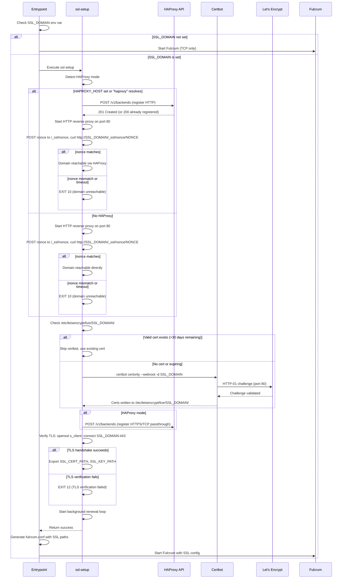
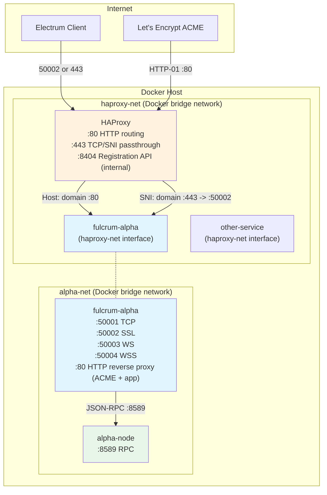

# SSL Management Architecture: In-Container Certificate Automation

**Status:** Specification
**Date:** 2026-03-30
**Scope:** Docker SSL lifecycle for Fulcrum-Alpha and reusable `ssl-manager` base image
**Replaces:** Host-injection SSL flow (`docker cp` + signal-file handshake)

---

## 1. Overview

### 1.1 Problem Statement

The current SSL deployment requires the host runner script (`run-fulcrum.sh`) to:

1. Start the container.
2. Wait for it to be ready.
3. Copy SSL certificates from the host's `/etc/letsencrypt/` into the container via `docker cp`.
4. Touch a signal file (`/tmp/.fulcrum-ready`) so the entrypoint knows certs have arrived.

This creates a race condition between the entrypoint (which needs certs before starting Fulcrum) and the runner script (which can only copy certs after the container is running). The signal-file handshake is fragile: if the runner script crashes after `docker run` but before signaling, the entrypoint waits 60 seconds and then starts without SSL. On restart, leftover files from previous runs cause the entrypoint to skip waiting entirely, potentially using stale certificates.

Additionally, the host must have certbot installed and configured. Certificate renewal is entirely a host concern with no container awareness.

### 1.2 Goals

1. **Self-contained SSL.** The container obtains and renews its own certificates via certbot. No host-side certbot installation required.
2. **Single environment variable trigger.** Setting `SSL_DOMAIN` activates SSL mode. Omitting it runs plain TCP only.
3. **HAProxy integration.** The container can register itself with an existing HAProxy reverse proxy for domain routing, enabling certbot HTTP-01 challenges to reach the container through HAProxy.
4. **Reusable base image.** SSL management logic lives in a generic `ssl-manager` base image that any Dockerized service can inherit.
5. **Elimination of race conditions.** No signal files, no `docker cp`, no host-to-container coordination.
6. **Persistent certificates.** Certificates survive container restarts via a Docker volume.

### 1.3 Design Principles

- **Fail fast by default, configurable fallback.** If SSL is requested but cannot be established, the container exits with a non-zero code and a clear error message. By default there is no fallback to non-SSL mode. However, setting `SSL_REQUIRED=false` allows the container to log a WARNING and continue in TCP-only mode when SSL setup fails. `SSL_REQUIRED` defaults to `true` when `SSL_DOMAIN` is set.
- **Idempotent startup.** Running the same container with the same `SSL_DOMAIN` multiple times produces the same result. Existing valid certificates are reused without re-requesting from Let's Encrypt.
- **Separation of concerns.** SSL setup is a pre-flight phase that completes before the service starts. The service binary never touches certbot.
- **No host dependencies.** The container needs only Docker networks and published ports. No host-side scripts, no `docker cp`, no signal files.

---

## 2. Multi-Layer Image Architecture

### 2.1 Layer 1: `ssl-manager` Base Image

A generic Debian-based image containing all SSL management tooling and an HTTP reverse proxy that shares port 80 between ssl-manager's `/_ssl/` management paths and the application's HTTP traffic. Any service that needs automated SSL inherits from this image.

**Contents:**
- certbot (via `apt`)
- curl, jq, openssl, netcat-openbsd (utilities)
- `APP_HTTP_PORT` environment variable (default: 8080) for reverse proxy upstream configuration
- `/usr/local/bin/ssl-setup` -- main SSL orchestration script
- `/usr/local/bin/ssl-renew` -- certificate renewal script
- `/usr/local/bin/haproxy-register` -- HAProxy registration client
- `/usr/local/bin/ssl-verify` -- domain reachability and TLS verification
- `/usr/local/bin/ssl-http-proxy` -- HTTP reverse proxy (ACME + nonce + health + app forwarding)

**Dockerfile pseudocode:**

```dockerfile
FROM debian:trixie-slim

RUN apt-get update && apt-get install -y --no-install-recommends \
        certbot \
        curl \
        jq \
        openssl \
        netcat-openbsd \
        python3 \
        ca-certificates \
    && apt-get clean \
    && rm -rf /var/lib/apt/lists/*

# SSL management scripts
COPY scripts/ssl-setup.sh       /usr/local/bin/ssl-setup
COPY scripts/ssl-renew.sh       /usr/local/bin/ssl-renew
COPY scripts/haproxy-register.sh /usr/local/bin/haproxy-register
COPY scripts/ssl-verify.sh      /usr/local/bin/ssl-verify
COPY scripts/ssl-http-proxy.py  /usr/local/bin/ssl-http-proxy

RUN chmod +x /usr/local/bin/ssl-setup \
             /usr/local/bin/ssl-renew \
             /usr/local/bin/haproxy-register \
             /usr/local/bin/ssl-verify \
             /usr/local/bin/ssl-http-proxy

# Let's Encrypt certificate storage -- mount a volume here
VOLUME ["/etc/letsencrypt"]
```

### 2.2 Layer 2: Service-Specific Image (Fulcrum-Alpha)

The Fulcrum-Alpha image uses a multi-stage build. The builder stage compiles Fulcrum. The runtime stage inherits from `ssl-manager` and adds the compiled binary plus Qt runtime dependencies.

**Dockerfile pseudocode:**

```dockerfile
# ---- Builder stage (unchanged from current) ----
FROM debian:trixie AS builder

RUN apt-get update && apt-get install -y \
        build-essential pkg-config zlib1g-dev libbz2-dev libjemalloc-dev \
        libzmq3-dev qtbase5-dev qt5-qmake libminiupnpc-dev openssl git

WORKDIR /src
COPY . .

RUN qmake -makefile PREFIX=/usr Fulcrum.pro && make $MAKEFLAGS install

# ---- Runtime stage: inherit from ssl-manager ----
FROM ssl-manager:latest

# Add Fulcrum-specific runtime dependencies
RUN apt-get update && apt-get install -y --no-install-recommends \
        libqt5network5 zlib1g libbz2-1.0 libjemalloc2 libzmq5 \
        python3 libminiupnpc18 procps \
    && apt-get clean \
    && rm -rf /var/lib/apt/lists/*

COPY --from=builder /src/Fulcrum /usr/bin/Fulcrum
COPY --from=builder /src/FulcrumAdmin /usr/bin/FulcrumAdmin

RUN mkdir -p /etc/fulcrum /data
COPY docker/fulcrum.conf.default /etc/fulcrum/fulcrum.conf.default

VOLUME ["/data"]

EXPOSE 50001 50002 50003 50004
# 80 is used by the ssl-manager HTTP reverse proxy (ACME challenges + app traffic forwarding)

HEALTHCHECK --interval=30s --timeout=10s --start-period=120s --retries=3 \
    CMD nc -z localhost 50001 || exit 1

COPY docker/docker-entrypoint.sh /entrypoint.sh
RUN chmod +x /entrypoint.sh

ENTRYPOINT ["/entrypoint.sh"]
CMD ["Fulcrum"]
```

### 2.3 Image Layering Rationale

```
+--------------------------------------------------+
|  fulcrum-alpha:latest                            |
|  - Fulcrum binary, FulcrumAdmin, Qt runtime      |
|  - fulcrum.conf.default                          |
|  - docker-entrypoint.sh (calls ssl-setup first)  |
+--------------------------------------------------+
|  ssl-manager:latest                              |
|  - certbot, curl, jq, openssl, netcat, python3   |
|  - ssl-setup, ssl-renew, haproxy-register        |
|  - ssl-http-proxy (reverse proxy on port 80)     |
|  - /etc/letsencrypt volume                       |
+--------------------------------------------------+
|  debian:trixie-slim                              |
+--------------------------------------------------+
```

Any future service (aggregator, IPFS gateway, dashboard) can also `FROM ssl-manager:latest` and get the same SSL automation without duplicating scripts.

---

## 3. SSL Setup Flow

### 3.1 Sequence Diagram



### 3.2 Step-by-Step Logic

#### Step 1: HAProxy Detection and Registration

The `ssl-setup` script determines whether HAProxy is available on the Docker network.

**Detection order:**
1. If `HAPROXY_HOST` environment variable is set, use its value (e.g., `haproxy`).
2. Otherwise, attempt to resolve the hostname `haproxy` via DNS (this succeeds if the container is on `haproxy-net` and the HAProxy container is named `haproxy`).
3. If neither resolves, assume no HAProxy (direct mode).

**Registration (HAProxy mode):**
```bash
# Register HTTP routing: domain:80 -> this container:80
PAYLOAD=$(jq -n \
    --arg domain "$SSL_DOMAIN" \
    --arg container "$(hostname)" \
    --argjson http_port 80 \
    '{domain: $domain, container: $container, http_port: $http_port, https_port: null}')

curl -sf -X POST "http://${HAPROXY_HOST}:${HAPROXY_API_PORT}/v1/backends" \
  -H "Content-Type: application/json" \
  ${HAPROXY_API_KEY:+-H "Authorization: Bearer $HAPROXY_API_KEY"} \
  -d "$PAYLOAD"
```

The `https_port: null` indicates "HTTP only for now." HTTPS passthrough is registered after the certificate is obtained (Step 3).

**Persistent HTTP server and reachability verification:**

A persistent HTTP reverse proxy runs on port 80 for the lifetime of the container. It serves four purposes:

1. **ACME challenges**: Serves certbot HTTP-01 challenge files from `/.well-known/acme-challenge/` (webroot mode).
2. **Nonce verification**: Provides `/_ssl/nonce/{nonce}` endpoints for domain reachability testing during setup.
3. **SSL health**: Exposes `/_ssl/health` with certificate status (expiry date, days remaining, renewal status).
4. **Application proxying**: Forwards all other HTTP traffic transparently to the application server at `localhost:$APP_HTTP_PORT` (default: 8080).

The application's HTTP server (if any) binds to `APP_HTTP_PORT` (default 8080) and has zero awareness of ssl-manager. It receives proxied requests with original headers, methods, and bodies intact. If no application is listening on `APP_HTTP_PORT`, the proxy returns 502 Bad Gateway for non-ssl-manager paths -- this is expected during SSL setup before the main service starts.

This design allows the application to use port 80 for its own HTTP traffic while ssl-manager transparently handles certificate operations on the same port. The application never needs to serve `/.well-known/acme-challenge/` or any other ssl-manager path.

```bash
WEBROOT="/var/www/acme-challenge"
mkdir -p "$WEBROOT/.well-known/acme-challenge"

# Start the ssl-manager HTTP reverse proxy on port 80.
# Routes:
#   /.well-known/acme-challenge/* → serve from $WEBROOT (certbot)
#   /_ssl/health                  → ssl-manager status JSON
#   /_ssl/nonce/*                 → nonce verification (setup only)
#   /*                            → reverse proxy to localhost:$APP_HTTP_PORT
APP_HTTP_PORT="${APP_HTTP_PORT:-8080}"

python3 /usr/local/bin/ssl-http-proxy \
    --port 80 \
    --webroot "$WEBROOT" \
    --upstream "127.0.0.1:${APP_HTTP_PORT}" \
    --cert-dir "/etc/letsencrypt/live/${SSL_DOMAIN:-}" &
HTTP_PROXY_PID=$!

# Wait for the proxy to be ready
for i in $(seq 1 10); do
    if nc -z localhost 80 2>/dev/null; then break; fi
    sleep 0.5
done

NONCE=$(openssl rand -hex 16)
# Register the nonce with the proxy (it stores it in memory, no files)
curl -sf -X POST "http://localhost:80/_ssl/nonce/${NONCE}" >/dev/null

# Verify: request the nonce through the public domain (proves end-to-end reachability)
NONCE_MATCHED=false
for ATTEMPT in 1 2 3; do
    RESPONSE=$(curl -sf --max-time 10 "http://${SSL_DOMAIN}/_ssl/nonce/${NONCE}" || true)
    if [ "$RESPONSE" = "$NONCE" ]; then
        NONCE_MATCHED=true
        break
    fi
    echo "[ssl-setup] Nonce attempt ${ATTEMPT}/3 failed, retrying in 5s..."
    sleep 5
done

# Clean up nonce from proxy memory
curl -sf -X DELETE "http://localhost:80/_ssl/nonce/${NONCE}" >/dev/null 2>&1 || true

if [ "$NONCE_MATCHED" != "true" ]; then
    echo "ERROR: Domain ${SSL_DOMAIN} is not routable to this container"
    echo "  Expected nonce: ${NONCE}"
    echo "  Got: ${RESPONSE:-<no response>}"
    exit 10
fi
```

> **Note:** The Registration API should block until HAProxy reload is confirmed (new workers accepting connections) before returning a success response. The retry loop above is a safety net for edge cases where the reload completes asynchronously.

The nonce verification is essential. It confirms end-to-end reachability: the Internet can reach port 80 of this container through either HAProxy or direct exposure. Without this, certbot would fail with an opaque ACME error.

**`/_ssl/health` endpoint:** The reverse proxy exposes a health/status endpoint at `/_ssl/health` that returns certificate status as JSON:

```json
{
    "status": "ok",
    "domain": "example.com",
    "cert_expires": "2026-06-28T12:00:00Z",
    "days_remaining": 89,
    "last_renewal_check": "2026-03-30T03:42:00Z",
    "app_upstream": "127.0.0.1:8080",
    "app_reachable": true
}
```

This provides a monitoring endpoint for certificate expiry without requiring shell access to the container. The `app_reachable` field indicates whether the upstream application server is responding on `APP_HTTP_PORT`.

The reverse proxy architecture eliminates several failure modes and design constraints:
- **Port 80 sharing**: The application and ssl-manager coexist on port 80 without awareness of each other. No port conflicts.
- **HAProxy health checks**: Port 80 is always listening, so HAProxy never marks the backend as DOWN.
- **Cert renewal reliability**: `certbot renew` uses webroot mode against the always-running proxy. No port binding needed.
- **No application cooperation required**: The application serves HTTP on `APP_HTTP_PORT` with no knowledge of ACME, nonces, or ssl-manager internals.
- **Nonce safety**: Nonces are stored in proxy memory (not files), eliminating file cleanup issues.

#### Step 2: Certificate Check and Acquisition

```bash
CERT_DIR="/etc/letsencrypt/live/${SSL_DOMAIN}"
CERT_FILE="${CERT_DIR}/fullchain.pem"
KEY_FILE="${CERT_DIR}/privkey.pem"

if [ -f "$CERT_FILE" ] && [ -f "$KEY_FILE" ]; then
    # Check expiry
    EXPIRY=$(openssl x509 -enddate -noout -in "$CERT_FILE" | cut -d= -f2)
    EXPIRY_EPOCH=$(date -d "$EXPIRY" +%s)
    NOW_EPOCH=$(date +%s)
    DAYS_LEFT=$(( (EXPIRY_EPOCH - NOW_EPOCH) / 86400 ))

    if [ "$DAYS_LEFT" -gt 30 ]; then
        echo "Existing certificate valid for ${DAYS_LEFT} days, reusing"
        return 0
    else
        echo "Certificate expires in ${DAYS_LEFT} days, renewing"
    fi
fi

# Obtain or renew certificate using webroot mode.
# The persistent HTTP server from Step 1 serves challenge files from $WEBROOT.
certbot certonly \
    --non-interactive \
    --agree-tos \
    ${SSL_ADMIN_EMAIL:+--email "$SSL_ADMIN_EMAIL"} \
    ${SSL_ADMIN_EMAIL:---register-unsafely-without-email} \
    --webroot \
    --webroot-path "$WEBROOT" \
    -d "${SSL_DOMAIN}" \
    2>&1 | tee /tmp/certbot.log

if [ ${PIPESTATUS[0]} -ne 0 ]; then
    echo "ERROR: certbot failed. Log output:"
    cat /tmp/certbot.log
    exit 11
fi
```

**Port 80 ownership during certbot:** Certbot uses webroot mode, which does not bind to any port. It writes challenge files to `$WEBROOT/.well-known/acme-challenge/` and the persistent HTTP server from Step 1 serves them. There is no port contention and no need to stop/restart any server.

#### Step 3: HTTPS Passthrough Registration and Verification

After the certificate is obtained, and only in HAProxy mode, register the HTTPS/TCP passthrough route:

```bash
if [ -n "$HAPROXY_DETECTED" ]; then
    # Determine the SSL port the service will listen on
    SERVICE_SSL_PORT="${SSL_SERVICE_PORT:-443}"

    # Idempotent POST: same domain + same container = 200 OK update
    PAYLOAD=$(jq -n \
        --arg domain "$SSL_DOMAIN" \
        --arg container "$(hostname)" \
        --argjson http_port 80 \
        --argjson https_port "${SERVICE_SSL_PORT}" \
        '{domain: $domain, container: $container, http_port: $http_port, https_port: $https_port}')

    curl -sf -X POST "http://${HAPROXY_HOST}:8404/v1/backends" \
      -H "Content-Type: application/json" \
      ${HAPROXY_API_KEY:+-H "Authorization: Bearer $HAPROXY_API_KEY"} \
      -d "$PAYLOAD"
fi
```

**TLS verification:**
```bash
# Start a temporary TLS server to verify the certificate works
openssl s_server -cert "$CERT_FILE" -key "$KEY_FILE" \
    -accept 8443 -www -quiet &
TLS_TEST_PID=$!
sleep 1

# Verify via the public domain (if HAProxy, this goes through TCP passthrough)
# Use the container's own address for direct verification first
VERIFY_RESULT=$(echo | openssl s_client -connect localhost:8443 \
    -servername "${SSL_DOMAIN}" 2>/dev/null \
    | openssl x509 -noout -subject 2>/dev/null)

kill $TLS_TEST_PID 2>/dev/null

if [ -z "$VERIFY_RESULT" ]; then
    echo "ERROR: TLS verification failed -- certificate may be invalid"
    exit 12
fi
```

#### Step 4: Hand Off to Service

```bash
# Export paths for the service entrypoint to consume
export SSL_CERT_PATH="${CERT_DIR}/fullchain.pem"
export SSL_KEY_PATH="${CERT_DIR}/privkey.pem"

# Certificate renewal loop (runs in background for container lifetime)
# Replaces cron — more reliable in containers without an init system
(
    # Initial delay: don't run immediately on startup
    sleep 3600  # 1 hour
    while true; do
        echo "[ssl-renew] Checking certificate renewal..."
        if certbot renew --webroot --webroot-path /var/www/acme-challenge \
             --deploy-hook "kill -USR1 \$(cat /var/run/fulcrum.pid 2>/dev/null) 2>/dev/null || true" \
             2>&1 | tee -a /var/log/certbot-renew.log; then
            echo "[ssl-renew] Renewal check complete"
        else
            echo "[ssl-renew] WARNING: Renewal check failed" >&2
        fi
        # Sleep 12 hours (±random jitter up to 30 minutes)
        JITTER=$((RANDOM % 1800))
        sleep $((43200 + JITTER))
    done
) &
RENEWAL_LOOP_PID=$!

echo "SSL setup complete for ${SSL_DOMAIN}"
echo "  Certificate: ${SSL_CERT_PATH}"
echo "  Private key: ${SSL_KEY_PATH}"
```

The service entrypoint reads `SSL_CERT_PATH` and `SSL_KEY_PATH` and writes them into the service configuration file (e.g., `fulcrum.conf`).

---

## 4. HAProxy Integration

### 4.1 Registration API Design

The HAProxy container currently has no runtime API. A new lightweight registration API must be added. This API runs as a sidecar process inside the HAProxy container.

**API Server:** A Python 3 HTTP server using only the standard library (`http.server`). No external dependencies. Runs as a background process started by the HAProxy entrypoint.

**Endpoint:** `http://haproxy:8404/v1/backends`

**Port 8404:** The HAProxy Stats port convention. The current `docker-compose.yml` already publishes port 8000. Port 8404 is chosen for the API to avoid conflicts; it will NOT be published to the host -- it is accessible only on `haproxy-net`.

#### API Endpoints

**POST /v1/backends -- Register a backend**

Request:
```json
{
    "domain": "electrum.example.com",
    "container": "fulcrum-alpha",
    "http_port": 80,
    "https_port": 50002
}
```

- `domain` (required): The domain to route.
- `container` (required): The container name or hostname on `haproxy-net`. This becomes the backend server address.
- `http_port` (required): Port for HTTP routing. Set to `null` to skip HTTP backend registration.
- `https_port` (required): Port for HTTPS/TCP passthrough. Set to `null` to skip HTTPS backend registration.

Response (201 Created):
```json
{
    "domain": "electrum.example.com",
    "container": "fulcrum-alpha",
    "http_port": 80,
    "https_port": 50002,
    "map_port": null,
    "created_at": "2026-03-30T12:00:00Z"
}
```

Response (200 OK, idempotent -- domain already registered to the SAME container):
```json
{
    "domain": "electrum.example.com",
    "container": "fulcrum-alpha",
    "http_port": 80,
    "https_port": 50002,
    "created_at": "2026-03-30T12:00:00Z",
    "message": "already registered"
}
```

Response (409 Conflict, domain already registered to a different container):
```json
{
    "error": "Domain 'electrum.example.com' is already registered to container 'other-service'",
    "code": "DOMAIN_CONFLICT",
    "existing": {
        "domain": "electrum.example.com",
        "container": "other-service",
        "http_port": 80,
        "https_port": 443,
        "created_at": "2026-03-30T12:00:00Z"
    }
}
```

Behavior:
1. Append entry to `domains.map`.
2. Execute `generate-config.sh` to regenerate `/etc/haproxy/conf.d/` and `maps/`.
3. Send `SIGUSR2` to the HAProxy master process for graceful reload (equivalent to `kill -USR2 $(cat /var/run/haproxy.pid)`). HAProxy's master-worker mode (`-W`) supports this for hitless reloads. The API should block until new workers are accepting connections before returning.
4. Return 201.

**GET /v1/backends -- List all backends**

Response (200 OK):
```json
{
    "backends": [
        {
            "domain": "electrum.example.com",
            "container": "fulcrum-alpha",
            "http_port": 80,
            "https_port": 50002,
            "created_at": "2026-03-30T12:00:00Z"
        }
    ],
    "count": 1
}
```

**GET /v1/backends/{domain} -- Check registration**

Response (200 OK):
```json
{
    "domain": "electrum.example.com",
    "container": "fulcrum-alpha",
    "http_port": 80,
    "https_port": 50002,
    "created_at": "2026-03-30T12:00:00Z"
}
```

Response (404 Not Found):
```json
{
    "error": "No registration found for domain 'electrum.example.com'",
    "code": "NOT_FOUND"
}
```

**DELETE /v1/backends/{domain} -- Unregister a backend**

Response: **204 No Content** (no response body).

Behavior:
1. Remove the entry from `domains.map`.
2. Regenerate config.
3. Reload HAProxy.

**POST /v1/reload -- Force config regeneration and reload**

Response (200 OK):
```json
{
    "message": "Configuration regenerated and HAProxy reloaded",
    "backends_count": 4,
    "reload_timestamp": "2026-03-30T12:00:00Z"
}
```

No request body. Runs `generate-config.sh` and reloads HAProxy unconditionally.

#### API Implementation Notes

- The API server is a single Python file: `/usr/local/bin/haproxy-api-server.py`.
- It reads/writes `domains.map` directly using file locking (`fcntl.flock`) to prevent concurrent writes.
- It calls `generate-config.sh` as a subprocess to regenerate `/etc/haproxy/conf.d/`.
- It sends SIGUSR2 to the HAProxy master process for reload.
- It binds to `0.0.0.0:8404` but is only reachable on `haproxy-net` because port 8404 is not published in `docker-compose.yml`.
- Optional authentication via `HAPROXY_API_KEY` environment variable (Bearer token in Authorization header). When not set, the API is trusted based on Docker network isolation -- it is only reachable from containers on the internal `haproxy-net` Docker network.

#### Changes to HAProxy docker-compose.yml

```yaml
services:
  haproxy:
    image: haproxy:lts
    container_name: haproxy
    restart: "on-failure:5"
    ports:
      - "80:80"
      - "443:443"
      - "8000:8000"
      # 8404 NOT published -- internal API only
    volumes:
      - ./conf.d:/etc/haproxy/conf.d
      - ./maps:/etc/haproxy/maps
      - ./domains.map:/etc/haproxy/domains.map
      - ./generate-config.sh:/usr/local/bin/generate-config.sh:ro
      - ./api/haproxy-api-server.py:/usr/local/bin/haproxy-api-server.py:ro
    # Override entrypoint to start both HAProxy and the API server
    entrypoint: ["/bin/sh", "-c"]
    command:
      - |
        python3 /usr/local/bin/haproxy-api-server.py &
        haproxy -W -f /etc/haproxy/conf.d
    networks:
      - haproxy-net

networks:
  haproxy-net:
    external: true
```

Key changes:
- Base image is `haproxy:lts`. The stock HAProxy image uses `/usr/local/etc/haproxy/` as its config directory. The Dockerfile adds a symlink so that `/etc/haproxy/conf.d` (the canonical path used in this spec) is reachable: `RUN ln -s /etc/haproxy/conf.d /usr/local/etc/haproxy/conf.d`.
- `conf.d` and `maps` volumes are now read-write (removed `:ro`) so the API can regenerate config.
- `domains.map` is mounted directly so the API can append entries.
- HAProxy runs in master-worker mode (`-W`) to support SIGUSR2 reloads.
- The API server starts as a background process before HAProxy.
- Restart policy is `on-failure:5` (not `always` or `unless-stopped`) to avoid infinite retry loops on permanent configuration errors.

### 4.2 HAProxy Routing for Fulcrum

Fulcrum uses non-standard ports (50001-50004) rather than 80/443. The HAProxy integration handles this as follows:

**HTTP (port 80) -- ssl-manager HTTP reverse proxy:**
- HAProxy routes `domain:80` to `fulcrum-alpha:80` (HTTP mode).
- Inside the Fulcrum container, the ssl-manager HTTP reverse proxy runs on port 80 for the lifetime of the container.
- The proxy intercepts `/.well-known/acme-challenge/*` (certbot webroot), `/_ssl/*` (management endpoints), and forwards everything else to `localhost:$APP_HTTP_PORT`.
- Certbot uses webroot mode to write challenge files; the proxy serves them.
- The proxy is always listening, so HAProxy health checks keep the backend marked as UP.

**HTTPS (port 443) -- Electrum SSL:**
- HAProxy routes `domain:443` to `fulcrum-alpha:50002` (TCP passthrough mode, SNI-based).
- TLS termination happens inside the Fulcrum container. HAProxy never sees the plaintext.
- Electrum clients connect to `domain:443` and get routed to Fulcrum's SSL port transparently.

**Why not the standard 443 inside the container:**
Fulcrum listens on 50002 for SSL, and changing this would break existing configurations and client expectations. HAProxy's TCP passthrough maps external 443 to internal 50002 seamlessly.

### 4.3 Fulcrum-Specific Port Mapping Through HAProxy

For Electrum protocol clients, the standard convention is port 50002 for SSL. Some deployments may want HAProxy to route port 50002 directly rather than 443. This is supported by adding additional TCP frontends in HAProxy:

```
# In domains.map, Fulcrum entries can use service-specific ports
# The http_port is always 80 (for certbot), but https_port varies
electrum.example.com    fulcrum-alpha    80    50002
```

The `generate-config.sh` already supports arbitrary port numbers in the `https_port` column. The HTTPS frontend on port 443 routes via SNI, and the backend connects to whatever port is specified.

---

## 5. Certificate Lifecycle

### 5.1 Acquisition

Certificates are obtained via Let's Encrypt using the ACME HTTP-01 challenge:

1. `ssl-setup` starts certbot in webroot mode with `--webroot-path /var/www/acme-challenge`.
2. Certbot writes challenge files to `/var/www/acme-challenge/.well-known/acme-challenge/`.
3. Let's Encrypt makes an HTTP request to `http://<domain>/.well-known/acme-challenge/<token>`.
4. This request arrives at HAProxy:80 (or directly at the container:80 if no HAProxy).
5. HAProxy routes it to the container based on Host header.
6. The ssl-manager HTTP reverse proxy on port 80 intercepts the `/.well-known/acme-challenge/` path and serves the challenge file from the webroot.
7. Let's Encrypt validates and issues the certificate.
8. Certbot writes the certificate to `/etc/letsencrypt/live/<domain>/`.

### 5.2 Storage

Certificates are stored in certbot's standard directory structure:

```
/etc/letsencrypt/
  live/
    <domain>/
      fullchain.pem    -> ../../archive/<domain>/fullchainN.pem
      privkey.pem      -> ../../archive/<domain>/privkeyN.pem
      cert.pem         -> ../../archive/<domain>/certN.pem
      chain.pem        -> ../../archive/<domain>/chainN.pem
  archive/
    <domain>/
      fullchain1.pem
      privkey1.pem
      ...
  renewal/
    <domain>.conf
```

**Volume mount:** `/etc/letsencrypt` is a Docker named volume (`letsencrypt-data`). This persists across container restarts and image upgrades. The volume is declared in the `ssl-manager` base image Dockerfile and should be mounted when running the container:

```bash
docker run ... -v letsencrypt-data:/etc/letsencrypt ...
```

**Permissions:** Certbot creates private keys with mode 0600. The service process must run as root or as a user with read access to the key files. Since Fulcrum currently runs as root inside the container, no permission changes are needed. Future hardening (running as a non-root user) would require adding the service user to a `ssl-cert` group and adjusting certbot's deploy hook to set group read permissions.

### 5.3 Renewal

Certbot renewal runs via a background loop in the entrypoint (not cron -- cron daemons are unreliable in containers without a full init system). The loop runs every 12 hours with random jitter to avoid thundering herd:

```bash
# Certificate renewal loop (started by ssl-setup, runs for container lifetime)
(
    sleep 3600  # Initial delay: 1 hour after startup
    while true; do
        echo "[ssl-renew] Checking certificate renewal..."
        if certbot renew --webroot --webroot-path /var/www/acme-challenge \
             --deploy-hook "/usr/local/bin/ssl-renew-hook" \
             2>&1 | tee -a /var/log/certbot-renew.log; then
            echo "[ssl-renew] Renewal check complete"
        else
            echo "[ssl-renew] WARNING: Renewal check failed" >&2
        fi
        # Sleep 12 hours (±random jitter up to 30 minutes)
        JITTER=$((RANDOM % 1800))
        sleep $((43200 + JITTER))
    done
) &
RENEWAL_LOOP_PID=$!
```

Benefits over cron:
- No cron daemon to die silently.
- Logs go to container stdout (visible via `docker logs`).
- The supervisor can track the PID.
- Self-documenting sleep interval.

The deploy hook (`ssl-renew-hook`):

```bash
#!/bin/bash
# Called by certbot after successful renewal

# Option A: Signal the service to reload SSL certs
# Fulcrum does not support runtime cert reload, so we log a notice.
# The service must be restarted to pick up new certs.
echo "Certificate renewed for ${RENEWED_DOMAINS}. Service restart required."

# Option B: If the service supports inotify-based cert watching, do nothing.
# Option C: Send SIGHUP to the service if it supports graceful cert reload.

# For Fulcrum, the safest approach is a graceful restart:
if pgrep -x Fulcrum > /dev/null; then
    echo "Restarting Fulcrum to load renewed certificate..."
    kill -TERM $(pgrep -x Fulcrum)
    # The supervisor loop in the entrypoint will restart Fulcrum automatically
    # since exit code from SIGTERM is non-zero in the supervisor's perspective.
    # However, we need the supervisor to NOT count this as a crash.
    # Solution: write a marker file that the supervisor checks.
    touch /tmp/.ssl-renewal-restart
fi
```

**Supervisor integration:** The entrypoint's supervisor loop must be updated to recognize `/tmp/.ssl-renewal-restart` as a planned restart (not a crash). The supervisor must delete this file unconditionally at the top of each iteration to prevent stale markers from affecting future loops. When this file exists at the point where Fulcrum has exited, the supervisor restarts Fulcrum immediately without incrementing the crash counter or cleaning the database:

```bash
# In run_fulcrum_supervised(), at the TOP of each iteration:
rm -f /tmp/.ssl-renewal-restart   # always clear stale marker

# ... start Fulcrum, wait for exit ...

# After Fulcrum exits, check if the marker was re-created by the renewal hook:
if [ -f /tmp/.ssl-renewal-restart ]; then
    rm -f /tmp/.ssl-renewal-restart
    echo "Planned restart for SSL certificate renewal"
    # Re-run ssl-setup to pick up new cert paths (they haven't changed,
    # but this validates the new cert)
    # Then restart Fulcrum immediately, no backoff
    continue
fi
```

> **Alternative signal approach:** Consider using SIGUSR1 for cert-renewal restarts to distinguish them from SIGTERM shutdowns. The supervisor can trap SIGUSR1, set a flag, then forward SIGTERM to Fulcrum. This avoids reliance on marker files entirely.

### 5.4 Renewal and Port 80

During renewal, certbot uses **webroot mode**. The ssl-manager HTTP reverse proxy runs on port 80 for the lifetime of the container, intercepting `/.well-known/acme-challenge/` requests and serving them from `/var/www/acme-challenge`. Certbot writes challenge files to this directory; the proxy serves them to Let's Encrypt. All other traffic on port 80 is forwarded to the application at `localhost:$APP_HTTP_PORT`.

This approach eliminates all port contention issues:
- The reverse proxy starts once during `ssl-setup` and never stops.
- Certbot does not bind to any port -- it only writes files to the webroot.
- HAProxy health checks see port 80 as always UP, preventing false-negative backend marking.
- No pre/post hooks needed for port management.
- The application can serve its own HTTP traffic on port 80 transparently through the proxy.

The renewal loop (see Section 5.3) invokes:
```bash
certbot renew --webroot --webroot-path /var/www/acme-challenge
```

---

## 6. Environment Variables

| Variable | Required | Default | Description |
|---|---|---|---|
| `SSL_DOMAIN` | No | (unset) | Domain name for SSL certificate. When set, activates SSL mode. When unset, container runs TCP only. |
| `SSL_ADMIN_EMAIL` | No | (unset) | Email for Let's Encrypt registration. If unset, registers without email (less secure -- no expiry notifications from Let's Encrypt). |
| `HAPROXY_HOST` | No | `haproxy` | Hostname of the HAProxy container. Default is `haproxy`. If unset, `ssl-setup` attempts to resolve `haproxy` via DNS. If resolution fails, assumes no HAProxy (direct mode). |
| `HAPROXY_API_PORT` | No | `8404` | Port of the HAProxy Registration API. |
| `SSL_SERVICE_PORT` | No | `50002` | The port inside the container where the service listens for TLS connections. HAProxy registers this as the HTTPS backend port. For Fulcrum, this is the Electrum SSL port. |
| `SSL_SKIP_VERIFY` | No | `false` | Skip TLS verification after cert acquisition. Useful in development where the domain may not be publicly reachable on port 443. |
| `SSL_REQUIRED` | No | `true` (when `SSL_DOMAIN` set) | When `true`, SSL setup failure is fatal (container exits). When `false`, SSL setup failure logs a WARNING and the container continues in TCP-only mode. Only meaningful when `SSL_DOMAIN` is set. |
| `SSL_STAGING` | No | `false` | Use Let's Encrypt staging environment. Produces untrusted certificates but avoids rate limits during testing. Adds `--staging` flag to certbot. |
| `APP_HTTP_PORT` | No | `8080` | Internal port where the application's HTTP server listens. The ssl-manager proxy on port 80 forwards non-management traffic here. Set to 0 to disable proxying (proxy returns 404 for non-ssl paths). |
| `SSL_TEST_MODE` | No | `false` | **Development/CI only.** When `true`, generates a self-signed certificate instead of calling certbot. Useful for testing the SSL setup flow without needing a publicly reachable domain or Let's Encrypt access. Do not use in production. |
| `HAPROXY_API_KEY` | No | (unset) | Shared secret for HAProxy Registration API authentication. When set, all API requests include an `Authorization: Bearer <key>` header. Strongly recommended for environments where multiple teams or untrusted containers share the Docker network. |
| `RPC_HOST` | Yes | `alpha-node` | Alpha node RPC hostname (existing variable, unchanged). |
| `RPC_PORT` | Yes | `8589` | Alpha node RPC port (existing variable, unchanged). |
| `RPC_USER` | Yes | `user` | Alpha node RPC username (existing variable, unchanged). |
| `RPC_PASS` | Yes | `password` | Alpha node RPC password (existing variable, unchanged). |

### 6.1 Usage Examples

**No SSL (current default behavior):**
```bash
docker run -d --name fulcrum-alpha \
    --network alpha-net \
    -p 50001:50001 \
    -v fulcrum-data:/data \
    fulcrum-alpha:latest
```

**SSL with HAProxy (standard production deployment):**
```bash
docker run -d --name fulcrum-alpha \
    --network alpha-net \
    --network haproxy-net \
    -e SSL_DOMAIN=electrum.example.com \
    -e SSL_ADMIN_EMAIL=admin@example.com \
    -v fulcrum-data:/data \
    -v letsencrypt-data:/etc/letsencrypt \
    fulcrum-alpha:latest
```

**SSL without HAProxy (container directly exposed):**
```bash
docker run -d --name fulcrum-alpha \
    --network alpha-net \
    -p 80:80 \
    -p 50001:50001 \
    -p 50002:50002 \
    -e SSL_DOMAIN=electrum.example.com \
    -v fulcrum-data:/data \
    -v letsencrypt-data:/etc/letsencrypt \
    fulcrum-alpha:latest
```

**SSL with Let's Encrypt staging (testing):**
```bash
docker run -d --name fulcrum-alpha \
    --network alpha-net \
    --network haproxy-net \
    -e SSL_DOMAIN=electrum.example.com \
    -e SSL_STAGING=true \
    -v fulcrum-data:/data \
    -v letsencrypt-data:/etc/letsencrypt \
    fulcrum-alpha:latest
```

---

## 7. Failure Modes

### 7.1 Exit Codes

| Code | Meaning | Cause | Resolution |
|---|---|---|---|
| 10 | Domain unreachable | Port 80 nonce test failed. The domain does not route to this container. | Verify DNS points to the correct IP. Verify HAProxy is running and port 80 is published. Verify the container is on `haproxy-net`. |
| 11 | Certbot failed | Let's Encrypt ACME challenge failed. | Check `/tmp/certbot.log` inside the container. Common causes: rate limiting, DNS not propagated, firewall blocking port 80. Use `SSL_STAGING=true` for testing. |
| 12 | TLS verification failed | Certificate obtained but TLS handshake fails. | Check certificate validity with `openssl x509 -in /etc/letsencrypt/live/<domain>/fullchain.pem -text`. Verify the certificate matches the domain. |
| 13 | HAProxy registration failed | HAProxy API returned an error or is unreachable. | Verify HAProxy container is running. Verify the API server is started. Check if another service already registered the same domain. |
| 14 | HAProxy reload failed | Config regeneration or HAProxy reload returned an error. | Check HAProxy logs. The generated config may be invalid. |
| 1 | General failure | Unspecified error in ssl-setup or the service. | Check container logs. |

### 7.2 Error Handling Strategy

**Fail fast (default):** Every step in `ssl-setup` checks its result and exits immediately on failure. There is no retry logic in the setup phase (except the 3-attempt nonce verification in Step 1). Docker's restart policy handles retries at the container level.

**Configurable fallback:** When `SSL_REQUIRED=false`, `ssl-setup` logs a WARNING on failure and returns a special exit code that the entrypoint interprets as "continue without SSL." The container starts in TCP-only mode. This is useful for development environments or initial deployments where DNS may not yet be configured.

**Recommended restart policy:** `--restart on-failure:5`. With `on-failure:5`, Docker retries up to 5 times with increasing backoff. This handles transient failures (HAProxy not yet started, DNS propagation delay) without infinite retry loops for permanent failures (wrong domain, firewall misconfiguration).

**Certbot rate limits:** Let's Encrypt enforces strict rate limits (5 duplicate certificates per week, 50 certificates per registered domain per week). The `ssl-setup` script mitigates this by:
1. Always checking for an existing valid certificate before calling certbot.
2. Using a Docker volume for `/etc/letsencrypt` so certificates persist across container restarts.
3. Supporting `SSL_STAGING=true` for development and testing.

**Partial failure states:**

| Scenario | Behavior |
|---|---|
| HAProxy registered but certbot fails | HAProxy has an HTTP route to a container that is not running. The route is harmless -- HAProxy will mark the backend as down. On next container start, `ssl-setup` detects no valid cert and retries certbot. |
| Cert obtained but HAProxy HTTPS registration fails | The container has a valid cert but HAProxy does not route HTTPS traffic to it. The container exits with code 13. On retry, it detects the existing cert (skips certbot) and retries HAProxy registration. |
| Cert obtained but service crashes on start | Normal crash recovery via the supervisor loop. Certificates are on the volume and persist. Restart does not re-run certbot (cert is still valid). |

### 7.3 Logging

All `ssl-setup` output goes to stdout/stderr and is captured by Docker's logging driver. Key events are prefixed for grep-ability:

```
[ssl-setup] Checking for HAProxy...
[ssl-setup] HAProxy detected at haproxy:8404
[ssl-setup] Registering HTTP backend for electrum.example.com
[ssl-setup] Domain reachability check: PASS
[ssl-setup] Existing certificate valid for 72 days, skipping certbot
[ssl-setup] Registering HTTPS backend for electrum.example.com -> fulcrum-alpha:50002
[ssl-setup] TLS verification: PASS
[ssl-setup] SSL setup complete
```

---

## 8. Network Architecture

### 8.1 Docker Network Topology



Note: `fulcrum-alpha` is a single container connected to both networks. The two boxes in the diagram represent the same container's interfaces on each network.

### 8.2 Port Mappings

**HAProxy container (published to host):**

| Host Port | Container Port | Protocol | Purpose |
|---|---|---|---|
| 80 | 80 | HTTP | Domain routing, ACME challenges |
| 443 | 443 | TCP | SNI-based TLS passthrough |
| 8000 | 8000 | HTTP | Map download (existing) |
| (none) | 8404 | HTTP | Registration API (internal only) |

**Fulcrum container (with HAProxy -- no ports published to host):**

| Container Port | Protocol | Purpose |
|---|---|---|
| 50001 | TCP | Electrum unencrypted |
| 50002 | SSL/TLS | Electrum encrypted |
| 50003 | WebSocket | Electrum WS |
| 50004 | WSS | Electrum WSS |
| 80 | HTTP | ssl-manager HTTP reverse proxy (ACME challenges, `/_ssl/*` management, app forwarding) |

When HAProxy is present, no Fulcrum ports need to be published to the host. All external traffic flows through HAProxy. Internal traffic on `alpha-net` (RPC to the Alpha node) stays on the private network.

**Fulcrum container (without HAProxy -- ports published to host):**

| Host Port | Container Port | Protocol | Purpose |
|---|---|---|---|
| 80 | 80 | HTTP | ssl-manager HTTP reverse proxy (ACME challenges + app forwarding) |
| 50001 | 50001 | TCP | Electrum unencrypted |
| 50002 | 50002 | SSL/TLS | Electrum encrypted |
| 50003 | 50003 | WebSocket | Electrum WS |
| 50004 | 50004 | WSS | Electrum WSS |

### 8.3 Traffic Flows

**Electrum client connection (through HAProxy):**
```
Client -> host:443 -> HAProxy:443 (TCP mode, inspect SNI)
  -> SNI matches "electrum.example.com"
  -> route to backend "fulcrum-alpha:50002" on haproxy-net
  -> TLS handshake with Fulcrum (passthrough, HAProxy sees only encrypted bytes)
  -> Electrum protocol over TLS
```

**Certbot HTTP-01 challenge (through HAProxy):**
```
Let's Encrypt -> host:80 -> HAProxy:80 (HTTP mode, inspect Host header)
  -> Host matches "electrum.example.com"
  -> route to backend "fulcrum-alpha:80" on haproxy-net
  -> ssl-http-proxy intercepts /.well-known/acme-challenge/* -> serves from webroot

Internet → HAProxy:80 → container:80 (ssl-http-proxy)
                                      ├── /.well-known/acme-challenge/* → webroot files
                                      ├── /_ssl/* → ssl-manager handlers
                                      └── /* → localhost:APP_HTTP_PORT (app)
```

**Fulcrum to Alpha node RPC:**
```
Fulcrum -> alpha-node:8589 on alpha-net (private, no external exposure)
  -> JSON-RPC over HTTP (unencrypted, trusted internal network)
```

### 8.4 Connecting to Multiple Networks

Docker containers can be connected to multiple networks. The `docker run` command only supports one `--network` flag, so the second network must be connected after container creation:

```bash
# Option A: docker run + docker network connect
docker run -d --name fulcrum-alpha --network alpha-net ... fulcrum-alpha:latest
docker network connect haproxy-net fulcrum-alpha

# Option B: docker-compose with multiple networks
services:
  fulcrum-alpha:
    networks:
      - alpha-net
      - haproxy-net
```

The `run-fulcrum.sh` script (simplified in the new design) should use Option A, or the deployment should move to a docker-compose file.

---

## 9. Security Considerations

### 9.1 Trust Boundaries

```
+----------------------------------------------------------+
| Docker Host                                              |
|                                                          |
|  +--------------------+   +---------------------------+  |
|  | haproxy-net        |   | alpha-net                 |  |
|  | (semi-trusted)     |   | (trusted)                 |  |
|  |                    |   |                           |  |
|  | HAProxy API :8404  |   | Alpha RPC :8589           |  |
|  | (no auth, network  |   | (username/password auth)  |  |
|  |  isolation only)   |   |                           |  |
|  +--------------------+   +---------------------------+  |
|                                                          |
| Internet (untrusted) -> ports 80, 443                    |
+----------------------------------------------------------+
```

**HAProxy Registration API:** The Registration API supports optional authentication via `HAPROXY_API_KEY`. When set, all API requests must include an `Authorization: Bearer <key>` header. This is strongly recommended for any environment where multiple teams or untrusted containers share the Docker network. See REGISTRATION_API_SPEC.md Section 10.2 for details. Without `HAPROXY_API_KEY`, security relies entirely on Docker network isolation -- only containers on `haproxy-net` can reach port 8404. This is acceptable for a single-host deployment where the operator controls which containers join `haproxy-net`.

**Let's Encrypt account key:** Stored in `/etc/letsencrypt/accounts/`. Persisted on the Docker volume. If the volume is compromised, an attacker can manage certificates for your account but cannot impersonate your domain (they still need to pass the ACME challenge).

**Private keys:** Stored in `/etc/letsencrypt/archive/<domain>/privkeyN.pem` with mode 0600 owned by root. The Docker volume should not be shared with untrusted containers.

### 9.2 Certificate Permissions

- Private key files: mode 0600, owned by root.
- Fullchain files: mode 0644, owned by root (public data).
- The Fulcrum process runs as root (current behavior). No permission issues.
- Future improvement: run Fulcrum as a dedicated user, add that user to a `ssl-cert` group, and set group read on private keys via a certbot deploy hook.

### 9.3 API Access Control

The HAProxy Registration API supports optional authentication via `HAPROXY_API_KEY`. Layered mitigations:

1. **Authentication (optional):** When `HAPROXY_API_KEY` is set, all API requests must include an `Authorization: Bearer <key>` header. Strongly recommended for multi-tenant or multi-team environments. See REGISTRATION_API_SPEC.md Section 10.2 for details.
2. **Network isolation:** Port 8404 is not published to the host. Only containers on `haproxy-net` can reach it.
3. **No destructive defaults:** Registering a domain that already exists with a different container returns 409, not an overwrite. Explicit DELETE is required to remove entries.
4. **Audit trail:** All API requests are logged to stdout.

### 9.4 Let's Encrypt Rate Limits

- 50 certificates per Registered Domain per week.
- 5 duplicate certificates per week.
- 300 new orders per account per 3 hours.
- Failed validation limit: 5 per hostname per hour.

Mitigations:
- Persistent volume avoids re-requesting on restart.
- Staging mode (`SSL_STAGING=true`) for testing.
- 30-day early renewal window (certbot default) prevents last-minute renewals.

### 9.5 Port 80 Exposure

Port 80 inside the container runs the ssl-manager HTTP reverse proxy. This proxy is always listening when `SSL_DOMAIN` is set. The attack surface is limited:

- The `/.well-known/acme-challenge/` path only serves static files from the webroot directory. It does not execute scripts or serve dynamic content.
- The `/_ssl/health` endpoint returns read-only certificate status JSON. It exposes no secrets.
- The `/_ssl/nonce/*` endpoints are used only during initial setup for domain reachability verification. Nonces are stored in memory and cleaned up after verification.
- All other paths are forwarded to `localhost:$APP_HTTP_PORT`. If no application is listening, the proxy returns 502 Bad Gateway. The proxy does not expose any internal services beyond the configured upstream.
- The proxy forwards requests transparently without modifying headers, methods, or bodies. It does not inject or strip security headers.

---

## 10. Migration Path

### 10.1 Current State (Being Replaced)

```
Host                              Container
------                            ---------
run-fulcrum.sh                    docker-entrypoint.sh
  |                                 |
  |-- docker run                    |-- wait_for_ready_signal()
  |-- docker cp fulcrum.conf        |     waits for /tmp/.fulcrum-ready
  |-- docker cp certs               |
  |-- docker exec touch .ready ---->|-- setup_config()
  |                                 |-- configure_ssl_and_websocket()
  |                                 |-- start Fulcrum
  |
  Host certbot renewal              No container awareness
  (cron on host)                    of cert changes
```

Problems:
1. Race condition between container start and file copy.
2. Signal file mechanism is fragile (stale files, timeout fallback).
3. Certificates are host-managed; container has no renewal capability.
4. `docker cp` does not handle Let's Encrypt symlinks correctly (requires `cat` workaround).
5. Restart requires re-running `run-fulcrum.sh` on the host if certs change.

### 10.2 Target State

```
Container (self-contained)
--------------------------
docker-entrypoint.sh
  |
  |-- (SSL_DOMAIN set?)
  |     |
  |     yes -> ssl-setup
  |              |-- detect HAProxy
  |              |-- register with HAProxy API
  |              |-- verify domain reachability
  |              |-- check existing cert on volume
  |              |-- certbot (if needed)
  |              |-- register HTTPS in HAProxy
  |              |-- verify TLS
  |              |-- start cron for renewal
  |              |-- export cert paths
  |     |
  |     no -> TCP only mode
  |
  |-- generate fulcrum.conf
  |-- start Fulcrum (supervisor loop)
```

### 10.3 Migration Steps

**Phase 1: Build `ssl-manager` base image**
1. Create `ssl-manager/` directory with Dockerfile and scripts.
2. Build and tag `ssl-manager:latest`.
3. Test with a minimal service (e.g., nginx) to validate certbot flow.
4. Push to container registry.

**Phase 2: Update Fulcrum Dockerfile**
1. Change runtime stage `FROM debian:trixie-slim` to `FROM ssl-manager:latest`.
2. Add `netcat-openbsd` and `procps` if not already in the base image (they are).
3. Increase `HEALTHCHECK --start-period` from 60s to 120s to accommodate SSL setup time.
4. Build and test locally.

**Phase 3: Rewrite `docker-entrypoint.sh`**
1. Remove `wait_for_ready_signal()` function entirely.
2. Remove `configure_ssl_and_websocket()` function.
3. Remove all `/ssl/` directory handling and `docker cp` assumptions.
4. Add SSL setup call:
   ```bash
   if [ -n "$SSL_DOMAIN" ]; then
       ssl-setup  # exits non-zero on failure
       # ssl-setup exports SSL_CERT_PATH and SSL_KEY_PATH
   fi
   ```
5. Update `setup_config()` to generate `fulcrum.conf` with SSL paths from environment variables rather than looking for copied files.
6. Keep the supervisor loop, crash recovery, and signal handling unchanged.
7. Add recognition of `/tmp/.ssl-renewal-restart` in the supervisor loop.

**Phase 4: Add HAProxy Registration API**
1. Create `haproxy/api/haproxy-api-server.py`.
2. Update `haproxy/docker-compose.yml` to mount and start the API.
3. Run `generate-config.sh` to ensure it works when called by the API.
4. Test registration, update, deletion, and reload.

**Phase 5: Simplify `run-fulcrum.sh`**
1. Remove all SSL certificate detection and copying logic.
2. Remove the signal file mechanism.
3. Remove the `docker cp` calls.
4. The script becomes: parse args, create config, `docker run` with env vars, connect to networks.
5. SSL is now controlled entirely by passing `-e SSL_DOMAIN=...` to `docker run`.

**Phase 6: Update documentation**
1. Update `docker/README.md` with new environment variables and usage.
2. Remove `docker/SSL_SETUP.md` (replaced by this architecture document).
3. Update `CLAUDE.md` with new Docker instructions.

### 10.4 Backward Compatibility

The new system is NOT backward compatible with the old `run-fulcrum.sh` workflow. This is intentional -- the old workflow is the source of the problems being solved. The migration is a clean break:

- **Old way:** `./run-fulcrum.sh --domain example.com` (host injects certs)
- **New way:** `docker run -e SSL_DOMAIN=example.com ...` (container manages certs)

Users must update their deployment scripts. The old `run-fulcrum.sh` will be replaced with a new version that uses environment variables instead of `docker cp`.

### 10.5 Rollback Plan

If the new system fails in production:
1. Revert the Dockerfile to use `debian:trixie-slim` as the runtime base.
2. Revert `docker-entrypoint.sh` to the signal-file version.
3. Use the old `run-fulcrum.sh`.
4. The `letsencrypt-data` volume is inert if not used -- it does not interfere with the old workflow.

---

## Appendix A: File Inventory

### ssl-manager base image

```
ssl-manager/
  Dockerfile
  scripts/
    ssl-setup.sh           # Main SSL orchestration (Steps 1-4)
    ssl-renew.sh           # Certbot renewal wrapper
    ssl-renew-hook.sh      # Post-renewal deploy hook
    haproxy-register.sh    # HAProxy API client
    ssl-verify.sh          # Domain reachability and TLS verification
    ssl-http-proxy.py      # HTTP reverse proxy (ACME + nonce + health + app forwarding)
```

### HAProxy additions

```
haproxy/
  api/
    haproxy-api-server.py  # Registration API server
  docker-compose.yml       # Updated with API server and -W flag
```

### Fulcrum-Alpha changes

```
docker/
  Dockerfile               # Updated: FROM ssl-manager:latest
  docker-entrypoint.sh     # Simplified: calls ssl-setup, no signal files
  run-fulcrum.sh           # Simplified: env vars only, no docker cp
  specs/
    SSL_MANAGEMENT_ARCHITECTURE.md  # This document
```

## Appendix B: ssl-setup Script Interface

**Inputs (environment variables):**
- `SSL_DOMAIN` -- required
- `SSL_ADMIN_EMAIL` -- optional
- `SSL_REQUIRED` -- optional (default: true when SSL_DOMAIN set)
- `SSL_TEST_MODE` -- optional (default: false, development/CI only)
- `HAPROXY_HOST` -- optional (default: `haproxy`)
- `HAPROXY_API_PORT` -- optional (default: 8404)
- `SSL_SERVICE_PORT` -- optional (default: 443)
- `SSL_SKIP_VERIFY` -- optional (default: false)
- `SSL_STAGING` -- optional (default: false)
- `APP_HTTP_PORT` -- optional (default: 8080, set to 0 to disable app forwarding)

**Outputs (environment variables, exported on success):**
- `SSL_CERT_PATH` -- absolute path to fullchain.pem
- `SSL_KEY_PATH` -- absolute path to privkey.pem

**Exit codes:**
- 0: success
- 10: domain unreachable
- 11: certbot failed
- 12: TLS verification failed
- 13: HAProxy registration failed
- 14: HAProxy reload failed

**Idempotency:** Safe to call multiple times. Existing valid certificates are reused. HAProxy registrations are idempotent (same domain + same container = 200 OK update).
